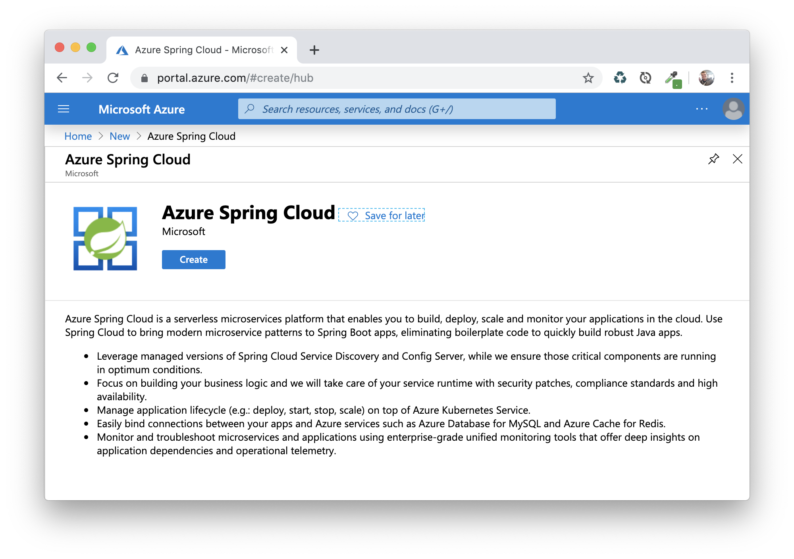
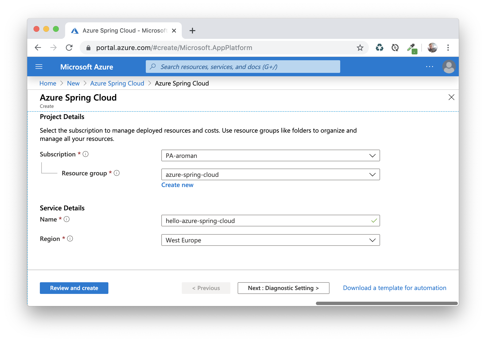
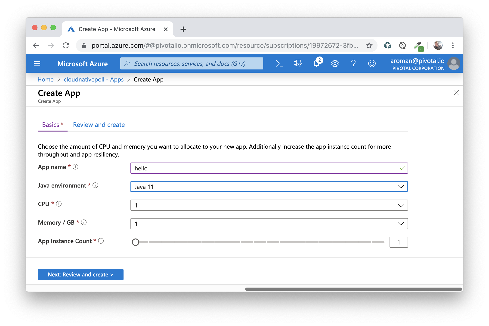
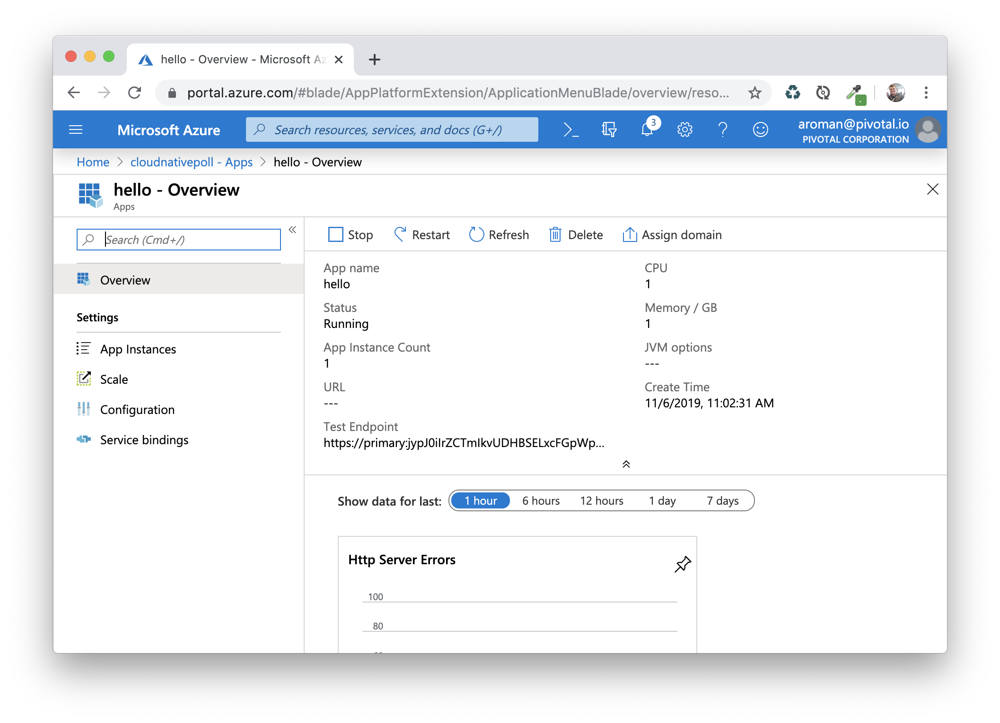
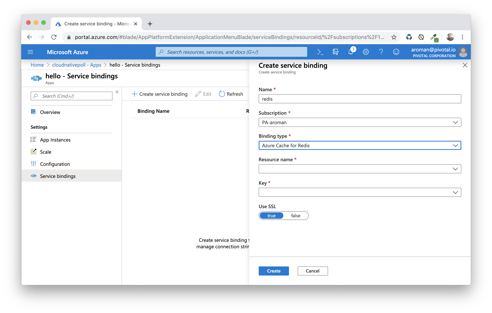
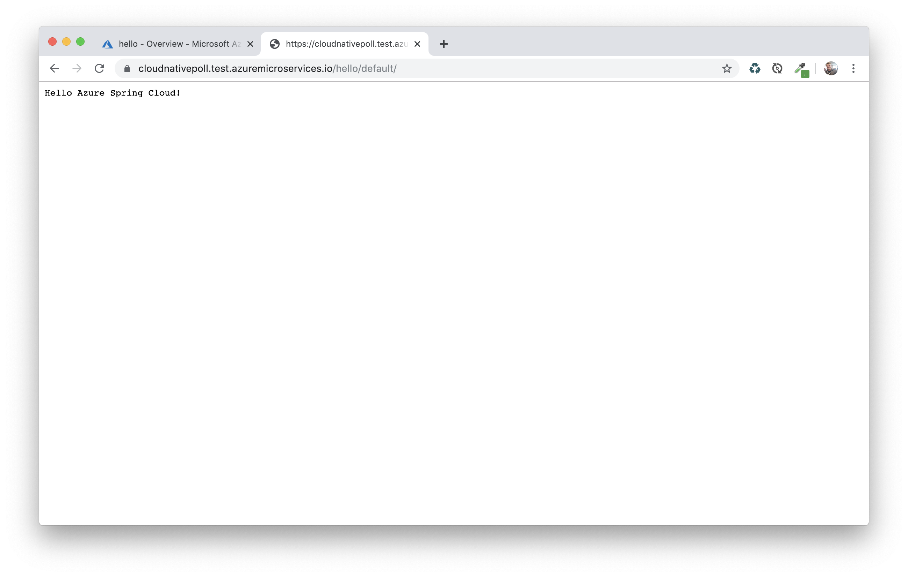
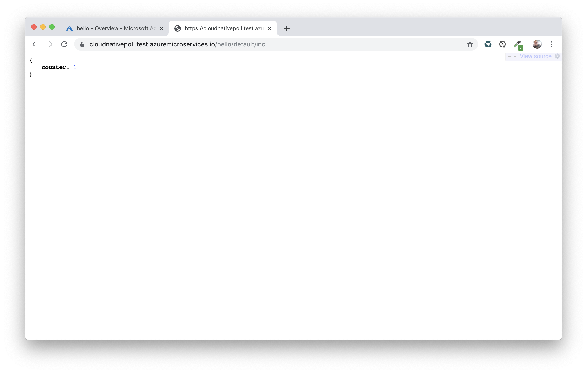

# Hello Azure Spring Cloud!

This project shows how to deploy a Spring Boot app to
[Azure Spring Cloud](https://azure.microsoft.com/services/spring-cloud/),
and how to bind it to a managed
[Azure Redis Cache instance](https://azure.microsoft.com/services/cache/)
using [Spring Data Redis](https://spring.io/projects/spring-data-redis).

## How to use it?

 Compile this app using a JDK 11+:
 ```bash
 $ ./mvnw clean package
 ```

 As you can see, the app source code is only using Spring Boot and Spring Data Redis:
 there's no dependency on Azure.

 ```java
 @SpringBootApplication
public class Application {
    public static void main(String[] args) {
        SpringApplication.run(Application.class, args);
    }
}

@ConfigurationProperties("app")
@ConstructorBinding
@Getter
@RequiredArgsConstructor
class AppProperties {
    private final String message;
}

@RestController
@RequiredArgsConstructor
class HelloController {
    private final AppProperties props;

    @GetMapping(value = "/", produces = MediaType.TEXT_PLAIN_VALUE)
    String hello() {
        return props.getMessage();
    }
}

@RestController
@RequiredArgsConstructor
class CounterController {
    private final RedisAtomicInteger counter;

    @GetMapping("/inc")
    Map<String, Object> incrementCounter() {
        final var value = counter.incrementAndGet();
        return Map.of("counter", value);
    }
}

@Configuration
class RedisConfig {
    @Bean
    RedisAtomicInteger counter(RedisConnectionFactory rcf) {
        return new RedisAtomicInteger("counter", rcf);
    }
}
 ```

If you never used Azure Spring Cloud before, you need to create a cluster first.
Create a new Azure Spring Cloud service using the Management console:



Enter cluster details:



Wait for the cluster to be created, then create a new app `hello`:



Make sure you select Java 11 as the Java environment.

Go the `hello` app page:



Let's bind this app to an Azure Redis Cache instance:



Almost done!

Make sure you have the
[Azure Spring Cloud CLI installed on your workstation](https://docs.microsoft.com/azure/spring-cloud/spring-cloud-quickstart-launch-app-cli#install-the-azure-cli-extension).

Now it's time to deploy your app to Azure Spring Cloud.
Use this command to push your JAR to the Cloud:
```bash
$ az spring-cloud app deploy -n hello --jar-path target/hello-azure-spring-cloud.jar
```

Go back to the `hello` app page: get the `Test Endpoint` URL.

Hit this URL:



Check that your app is bound to the Redis instance using the endpoint `/inc` to increment
a Redis integer value:



And voilà!

## Contribute

Contributions are always welcome!

Feel free to open issues & send PR.

## License

Copyright &copy; 2019 [Pivotal Software, Inc](https://pivotal.io).

This project is licensed under the [Apache Software License version 2.0](https://www.apache.org/licenses/LICENSE-2.0).
